# RAG Accelerator with Knowledge Graph Integration

## Project Overview

This is a **LangGraph RAG accelerator** combining a Python-based retrieval agent with a Next.js chat UI. The system features a unique **knowledge graph layer (Cognee)** on top of traditional vector search, providing semantic understanding beyond standard RAG implementations.

**Key Innovation**: Multi-backend architecture supporting 4 retriever types (Elasticsearch, Pinecone, MongoDB Atlas, Cognee) with user-scoped data isolation.

**Status**: ✅ Functional PoC achieved with production-ready architecture | ⚠️ Azure-native deployment templates in progress

## Architecture

### System Overview

```mermaid
graph TB
    User[👤 User] --> UI[Next.js Chat UI<br/>Port 3000]
    UI --> LG[LangGraph Server<br/>Port 2024]
    
    LG --> RG[Retrieval Graph<br/>query → retrieve → respond]
    LG --> IG[Index Graph<br/>ingest → stamp → store]
    
    RG --> LLM[Azure OpenAI / OpenAI<br/>GPT-4o, text-embedding-3-small]
    IG --> LLM
    
    RG --> VDB[(Vector Database)]
    IG --> VDB
    
    VDB --> ES[Elasticsearch]
    VDB --> PC[Pinecone]
    VDB --> MDB[MongoDB Atlas]
    VDB --> COG[Cognee<br/>Knowledge Graph]
    
    COG --> COGAPI[Cognee API<br/>Port 8000]
    COG --> COGMCP[Cognee MCP<br/>Port 3001]
    
    style UI fill:#e1f5ff
    style LG fill:#fff4e1
    style RG fill:#e8f5e9
    style IG fill:#e8f5e9
    style VDB fill:#f3e5f5
    style COG fill:#fce4ec
```



### Two-Service System

1. **`retrieval-agent/`** - Python LangGraph application with two graphs:
   - `indexer` (`index_graph.py`) - Ingests documents into vector stores
   - `retrieval_graph` (`graph.py`) - Handles conversational retrieval with chat history
   
2. **`agent-chat-ui/`** - Next.js frontend connecting to LangGraph servers via LangGraph SDK

### Retrieval Graph Flow


### Index Graph Flow

```mermaid
graph LR
    START([Documents]) --> STAMP[ensure_docs_have_user_id<br/>🏷️ Add user_id to metadata]
    STAMP --> INDEX[index_docs<br/>📥 Add to vector store]
    INDEX --> EMB[Generate embeddings<br/>text-embedding-3-small]
    EMB --> STORE[(Store in Vector DB<br/>with user_id filter)]
    STORE --> END([✅ Indexed])
    
    style STAMP fill:#ffebee
    style INDEX fill:#e8f5e9
    style EMB fill:#e3f2fd
    style STORE fill:#f3e5f5
```



### Multi-Backend Architecture

```mermaid
graph TB
    subgraph "Retriever Abstraction Layer"
        CONFIG[Configuration<br/>retriever_provider]
        FACTORY[get_retriever<br/>Factory Pattern]
    end
    
    CONFIG --> FACTORY
    
    FACTORY --> ES[make_elastic_retriever<br/>Elasticsearch]
    FACTORY --> PC[make_pinecone_retriever<br/>Pinecone]
    FACTORY --> MDB[make_mongodb_retriever<br/>MongoDB Atlas]
    FACTORY --> COG[make_cognee_retriever<br/>Knowledge Graph]
    
    ES --> ESDB[(Elasticsearch<br/>Vector Search)]
    PC --> PCDB[(Pinecone Cloud<br/>Managed Service)]
    MDB --> MDBDB[(MongoDB Atlas<br/>Vector Search)]
    COG --> COGDB[(Cognee<br/>Graph + Vector Hybrid)]
    
    ESDB --> FILTER[user_id filter applied<br/>🔒 Multi-tenant isolation]
    PCDB --> FILTER
    MDBDB --> FILTER
    COGDB --> FILTER
    
    FILTER --> RESULTS[Filtered Results<br/>User-specific data only]
    
    style CONFIG fill:#e1f5ff
    style FACTORY fill:#fff4e1
    style FILTER fill:#ffebee
    style RESULTS fill:#e8f5e9
```



### Critical Abstraction: User Isolation

```mermaid
graph LR
    subgraph "User A Session"
        UA[User A<br/>user_id: alice] --> QA[Query: 'My documents']
    end
    
    subgraph "User B Session"
        UB[User B<br/>user_id: bob] --> QB[Query: 'My documents']
    end
    
    QA --> RET[Retriever]
    QB --> RET
    
    RET --> FILTER{Apply user_id filter}
    
    FILTER --> DBA[(Docs with<br/>user_id: alice)]
    FILTER --> DBB[(Docs with<br/>user_id: bob)]
    
    DBA --> RESA[Results for Alice<br/>❌ Bob's docs excluded]
    DBB --> RESB[Results for Bob<br/>❌ Alice's docs excluded]
    
    style UA fill:#e3f2fd
    style UB fill:#fff3e0
    style FILTER fill:#ffebee
    style RESA fill:#e3f2fd
    style RESB fill:#fff3e0
```



**All retrievers enforce user-scoped filtering via `user_id`** in `configuration.py`. This enables multi-tenant deployments:
- Elasticsearch: `{"term": {"metadata.user_id": user_id}}`
- MongoDB: `{"user_id": {"$eq": user_id}}`
- Pinecone: `{"user_id": user_id}` in metadata filters
- Cognee: User-specific datasets

When adding new retrievers, **ALWAYS implement user_id filtering** in `retrieval.py`.

## Development Workflows

### Environment Setup

```bash
# Retrieval agent setup
cd retrieval-agent
cp .env.example ../.env.retrieval-agent
# Edit .env.retrieval-agent with:
# - OPENAI_API_KEY (required for embeddings)
# - Retriever credentials (ELASTICSEARCH_URL, PINECONE_API_KEY, etc.)

# Chat UI setup
cd agent-chat-ui
pnpm install
cp .env.example .env
# Set NEXT_PUBLIC_API_URL=http://localhost:2024
# Set NEXT_PUBLIC_ASSISTANT_ID=retrieval_graph
```

### Running the Stack

**Option 1: LangGraph Studio (Recommended)**
- Open `retrieval-agent/` folder in LangGraph Studio
- Studio auto-reads `langgraph.json` and `.env.retrieval-agent`
- Visual debugging of graph execution available

**Option 2: Docker Compose**
```bash
docker compose up cognee-api cognee-mcp  # Optional: elasticsearch
```

**Option 3: Local Development**
```bash
# Terminal 1: Start LangGraph server
cd retrieval-agent
langgraph dev --port 2024

# Terminal 2: Start UI
cd agent-chat-ui
pnpm dev  # Runs on http://localhost:3000
```

### Testing

```bash
cd retrieval-agent

# Unit tests (fast, no external dependencies)
make test

# Integration tests (requires vector store + OpenAI API)
export ELASTICSEARCH_URL=http://localhost:9200  # or your retriever
make integration_tests
```

**Test Pattern**: `tests/integration_tests/test_graph.py` demonstrates the full user journey:
1. Index documents for `user_id`
2. Query and verify retrieval
3. Verify isolation by querying with different `user_id`

### Code Quality

```bash
make lint        # Run ruff + mypy type checking
make format      # Auto-format with ruff
```

**Enforced Standards**:
- Strict mypy type checking (`--strict` flag in Makefile)
- Docstrings required (pydocstyle D rules in `pyproject.toml`)
- Import sorting (isort via ruff)

## Key Files to Understand

### Retrieval Agent Core

- **`src/retrieval_graph/configuration.py`** - Defines all configurable params including `user_id`, `retriever_provider`, and model selections. Uses `@dataclass` with metadata for LangGraph Studio integration.

- **`src/retrieval_graph/retrieval.py`** - Retriever factory pattern. Each `make_*_retriever()` function:
  1. Loads credentials from environment
  2. Initializes vector store with `make_text_encoder()`
  3. Applies user_id filtering
  4. Returns LangChain `VectorStoreRetriever`

- **`src/retrieval_graph/graph.py`** - Main conversational flow:
  1. `generate_query()` - First message uses input directly; subsequent uses LLM to refine based on history
  2. `retrieve()` - Fetches docs via configured retriever
  3. `generate()` - LLM generates response with retrieved context

- **`src/retrieval_graph/index_graph.py`** - Document ingestion. **Critical**: `ensure_docs_have_user_id()` stamps all docs with `user_id` metadata before indexing.

### Custom Cognee Integration

- **`src/langchain_cognee/retrievers.py`** - Custom `BaseRetriever` implementation communicating with Cognee HTTP API. Notable:
  - `add_documents()` - Accepts list of LangChain Documents
  - `process_data()` - Triggers knowledge graph construction (can take minutes)
  - `_get_relevant_documents()` - Queries via `/search` endpoint with `GRAPH_COMPLETION` search type

### Chat UI Integration Points

- **`src/app/api/[...path]/route.ts`** - Proxies all requests to LangGraph server using `langgraph-nextjs-api-passthrough`
- **`src/providers/Thread.tsx`** - Manages thread state, streaming, and LangGraph SDK client initialization
- **Environment variables override setup form** - Set `NEXT_PUBLIC_API_URL` and `NEXT_PUBLIC_ASSISTANT_ID` to skip config screen

## Common Patterns

### Adding a New Retriever

1. Add provider option to `retriever_provider` Literal in `configuration.py`
2. Implement `make_<provider>_retriever()` in `retrieval.py`:
   ```python
   @contextmanager
   def make_custom_retriever(
       configuration: IndexConfiguration, embedding_model: Embeddings
   ) -> Generator[VectorStoreRetriever, None, None]:
       # 1. Load from env: os.environ["CUSTOM_API_KEY"]
       # 2. Initialize vector store with embedding_model
       # 3. CRITICAL: Apply user_id filter to search_kwargs
       search_kwargs = configuration.search_kwargs
       search_filter = search_kwargs.setdefault("filter", {})
       search_filter["user_id"] = configuration.user_id
       yield vstore.as_retriever(search_kwargs=search_kwargs)
   ```
3. Register in `get_retriever()` match statement
4. Update `.env.example` with required credentials
5. Add integration test in `test_graph.py` with new `retriever_provider` value

### Changing LLM Models

**For retrieval responses**:
```python
config = RunnableConfig(
    configurable={
        "response_model": "openai/gpt-4o",  # or "anthropic/claude-3-5-sonnet-20241022"
    }
)
```

**For query generation**:
```python
config = RunnableConfig(
    configurable={
        "query_model": "openai/gpt-4o-mini",
    }
)
```

Model format: `provider/model-name`. Supported providers in `utils.py`: `openai`, `anthropic`, `fireworks`.

### Modifying Prompts

System prompts are in `src/retrieval_graph/prompts.py`:
- `RESPONSE_SYSTEM_PROMPT` - Governs final LLM response generation
- `QUERY_SYSTEM_PROMPT` - Guides query refinement for multi-turn conversations

Override via configuration:
```python
Configuration(
    response_system_prompt="Custom instructions here...",
    query_system_prompt="Custom query refinement..."
)
```

## Debugging Tips

### Enable Debug Logging

```python
# Add to top of graph.py, retrieval.py, or any module
import logging
logger = logging.getLogger(__name__)
logger.setLevel(logging.DEBUG)  # Already set in key files
```

Logs include emoji prefixes: 🔧 (initialization), 🔍 (search), 💬 (messages), ✅ (success), ❌ (error)

### LangGraph Studio Visualization

- Time-travel debugging: Inspect state at each graph node
- View retrieved documents in `retrieve` node output
- Check token usage and latency per node
- Re-run from any checkpoint

### Common Issues

**"No documents returned"** - Check:
1. Documents indexed with correct `user_id`? (Run indexer graph)
2. Query embedding dimensions match store? (1536 for `text-embedding-3-small`)
3. User isolation filter applied? (Set `user_id` in config)

**"API key not found"** - Environment loading:
- LangGraph Studio: Uses `../.env.retrieval-agent` (relative to `retrieval-agent/` folder)
- Local `langgraph dev`: Uses `.env` in current directory
- Docker Compose: Pass via `environment:` in `compose.yaml`

## Documentation Structure

### Core Documentation
- **`REQUIREMENTS.md`** - Original project scope and deliverables (see status below)
- **`PROJECT_SUMMARY.md`** - Comprehensive achievement overview vs. original scope
- **`AZURE_MIGRATION_PLAN.md`** - Migration strategy from current Docker setup to Azure-native services
- **`APPROACH.md`** - Research notes on Microsoft data connectors (SharePoint, Dataverse, Azure SQL)

### Component Documentation
- **`retrieval-agent/README.md`** - Detailed setup instructions for all 4 retriever backends
- **`agent-chat-ui/README.md`** - Frontend usage and customization guide

---

## 📊 Requirements Tracking

### ✅ Completed Technical Deliverables

- [x] **Functional PoC Solution** - RAG pipeline deployed locally with Docker Compose; supports 4 retriever backends
- [x] **Multi-Source Data Ingestion** - Generic document ingestion pipeline accepting any text/document format
- [x] **Context-Aware Responses** - Successfully retrieves and references source documents with citations
- [x] **Codebase/Repo Structure** - Modular Python codebase with clear separation of concerns
  ```
  /retrieval-agent/src
    /langchain_cognee      # Custom Cognee retriever
    /retrieval_graph       # Main RAG pipeline
      configuration.py     # All configurable parameters
      graph.py            # Retrieval chat flow
      index_graph.py      # Document ingestion
      retrieval.py        # Retriever factory pattern
      prompts.py          # System prompts
      utils.py            # Model loading utilities
  /agent-chat-ui           # Next.js frontend
  /tests
    /integration_tests     # Full user journey tests
    /unit_tests           # Component tests
  ```
- [x] **LangGraph Flows** - Two graphs implemented:
  - `indexer` (`index_graph.py`) - Document ingestion with user_id stamping
  - `retrieval_graph` (`graph.py`) - Conversational retrieval with chat history
- [x] **Azure Resources Setup** - Local development environment complete; Docker Compose orchestration

### ✅ Completed Documentation Deliverables

- [x] **Step-by-Step Build Guide** - `retrieval-agent/README.md` with setup for all 4 backends
- [x] **Demo/Walkthrough Guide** - Integration tests in `tests/integration_tests/test_graph.py` demonstrate:
  1. Index documents for specific user_id
  2. Query and verify retrieval
  3. Verify user isolation (different user_id returns no results)
- [x] **Architecture Overview** - Comprehensive Mermaid diagrams showing:
  - System overview with all components
  - Retrieval graph execution flow (generate_query → retrieve → respond)
  - Index graph flow with user_id stamping
  - Multi-backend abstraction layer
  - User isolation mechanism
- [x] **Consulting Readiness Notes** - Modular architecture enables easy customer adaptation:
  - Switch retrievers via `retriever_provider` config (no code changes)
  - Replace sample documents with customer data sources
  - Point to customer vector stores using environment variables

### ⚠️ In Progress Deliverables

- [ ] **Azure AI Foundry Deployment** - Currently uses Docker Compose locally
  - **Blockers**: Needs Bicep/ARM templates for:
    - Azure Container Apps or AKS for Cognee services
    - Azure OpenAI Service integration (currently uses OpenAI API)
    - Azure AI Search (to replace self-hosted Elasticsearch)
    - Azure Key Vault for secrets management
  - **Path Forward**: See `AZURE_MIGRATION_PLAN.md` for detailed migration strategy

### ❌ Deferred (Awaiting Customer Requirements)

- [ ] **SharePoint Online Connector** - Generic document ingestion works; SharePoint-specific connector requires:
  - Customer SharePoint site URL and credentials
  - Azure AD app registration with appropriate permissions
  - Specific document libraries to index
  
- [ ] **Microsoft Dataverse Connector** - Dataverse SDK available but not integrated:
  - Requires customer Dataverse environment URL
  - Service principal authentication setup
  - Understanding of customer tables/entities to index
  
- [ ] **SQL Server/Azure SQL Connector** - SQL ingestion possible via LangChain's SQL loaders:
  - Requires customer database schema
  - Connection string configuration
  - Decision on what tables/queries to expose to RAG

**Rationale for Deferral**: Building enterprise connectors without real customer data or authentication contexts would result in speculative code. The current generic pipeline allows rapid integration once customer specifics are available.

### ✅ Bonus: Stretch Goals Achieved

- [x] **Multi-turn memory** - Implemented in `graph.py` via LangGraph state management
- [x] **Vector database abstraction layer** - Supports switching between Elasticsearch, Pinecone, MongoDB Atlas, Cognee
- [x] **Knowledge graph integration** - Cognee provides relationship-aware retrieval beyond vector similarity

### 🎯 Outstanding Stretch Goals

- [ ] **Feedback loop** - Rate responses and store feedback (could use Dataverse or Azure Cosmos DB)
- [ ] **Teams Copilot integration** - Power Apps Copilot for conversational access
- [ ] **Azure AI Foundry native integration** - Using Azure AI Studio for model management and monitoring

---

## What Remains: Priority Action Items

### High Priority (Required for Azure Consulting Accelerator)

1. **Azure Deployment Templates** (`AZURE_MIGRATION_PLAN.md` has detailed plan)
   - Create Bicep templates for:
     - Azure OpenAI Service with model deployments (gpt-4o, text-embedding-3-small)
     - Azure AI Search (replace Elasticsearch)
     - Azure Container Apps (for Cognee API + MCP)
     - Azure Key Vault (for secrets management)
   - Update `retrieval.py` to support Azure OpenAI embeddings
   - Update `utils.py` to support `azure/model-name` format
   - Create deployment workflow documentation

### Medium Priority (Required for Customer Deployments)

2. **Enterprise Data Connectors** (implement on-demand during consulting engagement)
   - **SharePoint**: Use `langchain-community`'s `SharePointLoader`
     - Authentication via MSAL (Azure AD)
     - Document library ingestion
     - Incremental sync strategy
   
   - **Dataverse**: Use `dataverse-sdk-python`
     - Service principal authentication
     - Table/entity selection UI
     - Field mapping to document metadata
   
   - **Azure SQL**: Use LangChain's `SQLDatabaseLoader`
     - Connection pooling configuration
     - Query-based ingestion (views or stored procedures)
     - Sensitive data masking

3. **Production Hardening**
   - Error handling and retry logic for API calls
   - Rate limiting and throttling
   - Cost monitoring and budget alerts
   - Telemetry integration (Azure Application Insights)

### Low Priority (Nice to Have)

4. **Feedback Loop**
   - Add thumbs up/down to chat UI
   - Store feedback in Azure Cosmos DB or Dataverse
   - Display feedback analytics dashboard

5. **Teams Integration**
   - Teams bot setup using Bot Framework
   - Adaptive cards for formatted responses
   - Multi-user thread management

---

## Documentation Structure

## What Makes This Codebase Unique

1. **Production-grade abstractions** - Not a tutorial, but a reusable accelerator with proper error handling, logging, and type safety
2. **Knowledge graph hybrid** - Cognee integration goes beyond vector similarity to understand entity relationships
3. **Multi-backend flexibility** - Switch retrievers via config, not code changes
4. **User isolation by default** - Multi-tenancy built into the architecture from day one
5. **LangGraph Studio compatible** - Visual debugging and development workflow

When extending this codebase, maintain these principles: user isolation, provider abstraction, and comprehensive logging.

---

## Quick Start

Choose your deployment method:

### Option 1: LangGraph Studio (Recommended for Development)
```bash
# 1. Setup environment
cd retrieval-agent
cp .env.example ../.env.retrieval-agent
# Edit .env.retrieval-agent with your API keys

# 2. Open retrieval-agent/ folder in LangGraph Studio
# Studio will auto-read langgraph.json and .env.retrieval-agent
```

### Option 2: Docker Compose (Recommended for Demos)
```bash
# Start Cognee services + optional Elasticsearch
docker compose up cognee-api cognee-mcp elasticsearch

# In another terminal, start the chat UI
cd agent-chat-ui
pnpm install
pnpm dev  # http://localhost:3000
```

### Option 3: Local Development
```bash
# Terminal 1: Start LangGraph server
cd retrieval-agent
langgraph dev --port 2024

# Terminal 2: Start chat UI
cd agent-chat-ui
pnpm dev
```

See component READMEs for detailed setup instructions:
- `retrieval-agent/README.md` - Backend setup for all 4 retriever types
- `agent-chat-ui/README.md` - Frontend configuration

---

## Testing

```bash
cd retrieval-agent

# Fast unit tests (no external dependencies)
make test

# Integration tests (requires retriever + OpenAI API)
export ELASTICSEARCH_URL=http://localhost:9200
make integration_tests

# Code quality checks
make lint    # ruff + mypy type checking
make format  # auto-format code
```

Test coverage includes:
- User isolation verification (different user_ids can't access each other's data)
- Multi-turn conversation handling
- All 4 retriever backends (when credentials provided)

---

## Contributing

This is a consulting accelerator template. When extending:

1. **Maintain user isolation** - Always filter by `user_id` in new retrievers
2. **Follow the abstraction pattern** - New retrievers go in `retrieval.py` as `@contextmanager` functions
3. **Add integration tests** - Test new features with real retriever backends
4. **Document environment variables** - Update `.env.example` with new credentials
5. **Keep logging comprehensive** - Use emoji prefixes (🔧 🔍 💬 ✅ ❌) for structured logs

---

## License

See `LICENSE` files in `retrieval-agent/` and `agent-chat-ui/` directories.

---

## Support

For questions about:
- **Setup/Configuration**: Check component READMEs
- **Azure Migration**: See `AZURE_MIGRATION_PLAN.md`
- **Architecture Decisions**: See `PROJECT_SUMMARY.md`
- **Enterprise Connectors**: See `APPROACH.md`
